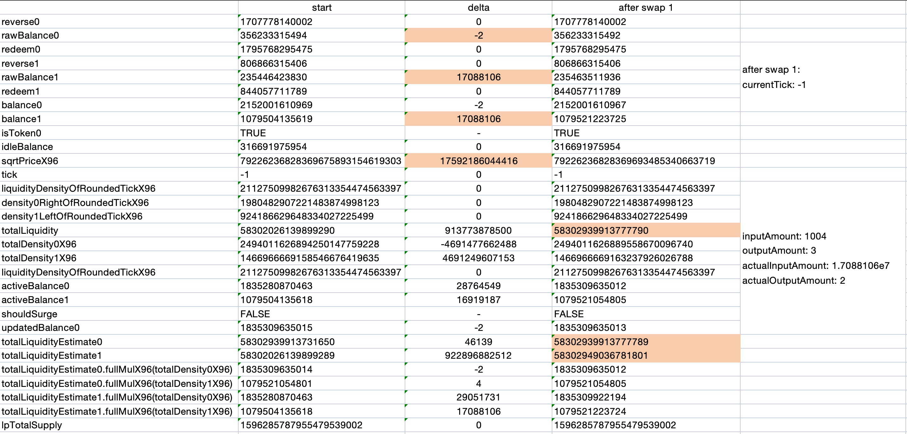
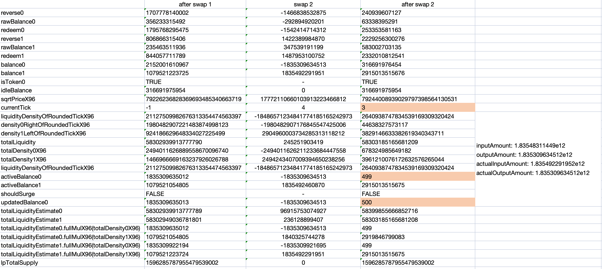
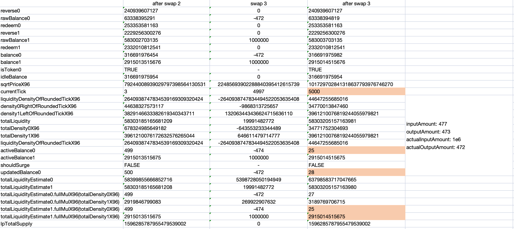
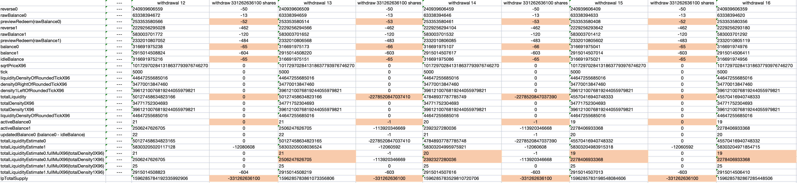
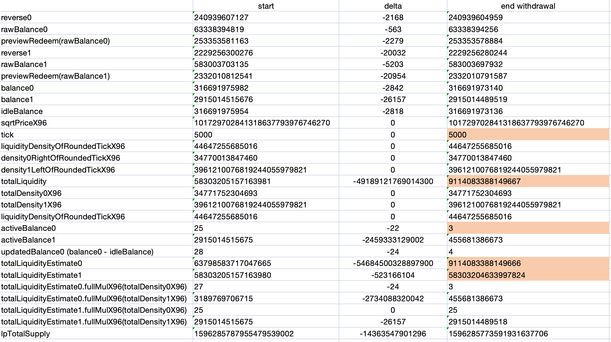
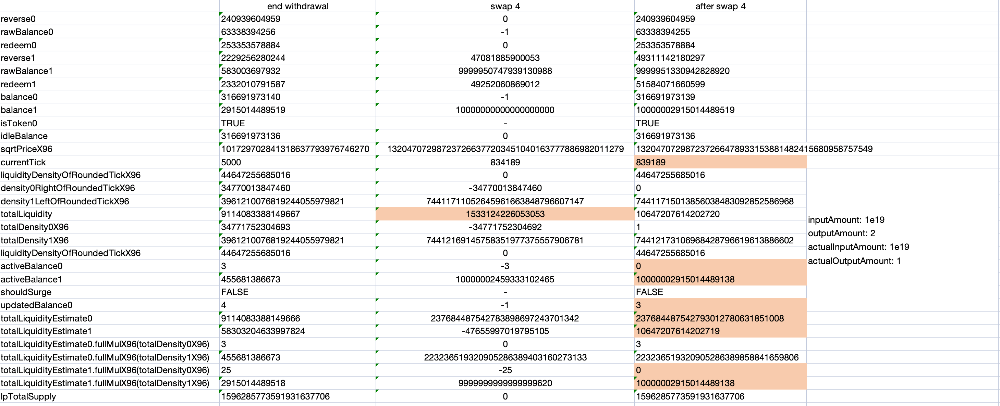
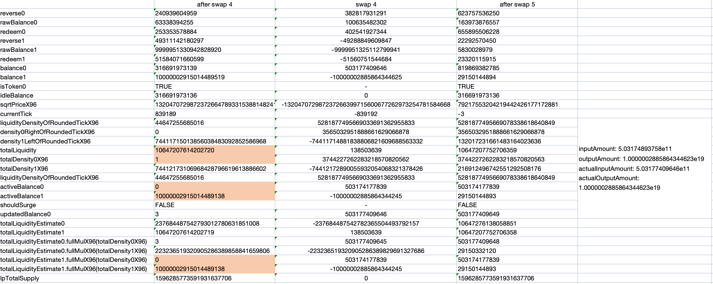

<!-- # BunniV2 Exploit Analysis -->

在2025年9月2日，黑客利用 Bunni V2的漏洞总共盗取了约 840 万美元，受影响的两个池子分别是 Unichain 上的 weETH/ETH 和 ETH 上的 USDC/USDT。

黑客基本信息：

```
攻击交易:
* https://etherscan.io/tx/0x1c27c4d625429acfc0f97e466eda725fd09ebdc77550e529ba4cbdbc33beb97b
* https://uniscan.xyz/tx/0x4776f31156501dd456664cd3c91662ac8acc78358b9d4fd79337211eb6a1d451

手续费来源交易： 0x047daf0df44f84a042596b46069842a297a1c81ae7b0372c92c8989bb947ebbc 
手续费来源地址： 0x5baBE600b9fCD5fB7b66c0611bF4896D967b23A1（Arkham平台标记为 "疑似Gas.zip"）
```

## 漏洞分析

本次分析参考以下分析文章：

* https://blog.bunni.xyz/posts/exploit-post-mortem/#final-words
* https://gist.github.com/giovannidisiena/716324d50b6649be3a0e91395890917e

Unichain 上的 weETH/ETH 和 ETH 上的 USDC/USDT 的攻击方式相同，以下使用  ETH 上的 USDC/USDT 进行分析。

### 漏洞详情

在官方给出的漏洞通报中说明了漏洞点出现在 BunniHub::withdraw() 函数：

```solidity
// decrease idle balance proportionally to the amount removed
{
    (uint256 balance, bool isToken0) = IdleBalanceLibrary.fromIdleBalance(state.idleBalance);
>>> uint256 newBalance = balance - balance.mulDiv(shares, currentTotalSupply); // this line
    if (newBalance != balance) {
        s.idleBalance[poolId] = newBalance.toIdleBalance(isToken0);
    }
}
```

上述代码主要用来处理 withdraw 时更新 idleBalance 的需求。在流动性提供者提取其对应的份额（withdraw shares）时，池子会按比例减少其闲置余额（idleBalance），减少的数量是 balance.mulDiv(shares, currentTotalSupply) 。

```solidity
/// @dev Returns `floor(x * y / d)`.
/// Reverts if `x * y` overflows, or `d` is zero.
function mulDiv(uint256 x, uint256 y, uint256 d) internal pure returns (uint256 z) {...}
```

需要注意的是，这里特意使用了 **mulDiv** 对结果进行向下取整，这是因为项目方认为这样的操作会对应的让 idleBalance 向上取整，从而使得 activeBalance 向下取整。这在 defi 的开发过程中被认为是一种安全的取整方向，因为较低的流动性会让 swap 的过程中价格变化更大，从而使池子受益（其实这是一种低估的假设，如果低估了池子中的流动性，那么会使 swap / redeem 变得更困难，获得的 token 越少）。

## 攻击流程

此次漏洞利用主要是分为以下三步：

* **Swap**
  攻击者首先闪电贷了 3m USDT，然后进行了多次 swap 将池子里的 spot price tick 抬高至 5000。最关键的是，使用精心构造的参数进行 swap，将池子里的 USDC 的 activeBalance0 （活跃余额，即用于提供兑换流动性的 USDC 数量）从 1.835280870463e12 减少到 25 wei。

* **Withdraw**

  攻击者进行了 44 次小额提现，利用 **RoundingDown** 漏洞将 USDC 的 activeBalance0 从 25 wei 降至 3 wei，降幅达 88%，并使得池子里的 totalLiquidity 错误地从 5.83e16 降至 9.114e15，降幅达 84.4%。

* **SwapBack**

  随着流动性的下降，攻击者进行了大额的 USDT -> USDC swap，进一步推高 spot price tick 至 839189（相当于1 USDC = 2.77e36 USDT）。第一次 swap 导致池子的 totalLiquidity 从 9.114e15 增加到 1.065e16，**反向增加了16.8%**（与 步骤2 中的 totalLiquidity 的下降趋势相反）。随后，攻击者以这个虚高的价格进行了 USDC -> USDT swap，由于流动性的增加，攻击者得以获利。

最后，在偿还步骤1中的闪电贷后，攻击者获得约 1.33m USDC 和约 1m USDT 的利润。

### 攻击前

关键变量：

* pool balance：
  * activeBalance：活跃的 token ，用于提供 swap 的流动性。
  * idleBalance：闲置的 token。在提供新流动性时，多余的 token0 有可能放不进 Uniswap V3 头寸里（因为当前价格已经很靠右，可能完全不需要  token0 ），这时候就会暂存到  idleBalance 。此部分不会用于提供流动性，除非进行 rebalancing / surge。
* token0/token1 balance：token0 或者 token1 的数量
  * balance0 = rawBalance0 + previewRedeem(reserve0)
  * balance1 = rawBalance1 + previewRedeem(reserve1)

* totalLiquidityEstimate：以 token0 或者 token1 来预估整个池子的流动性
  * uint256 totalLiquidityEstimate0 = balance0.fullMulDiv(Q96, totalDensity0X96)
  * uint256 totalLiquidityEstimate1 = balance1.fullMulDiv(Q96, totalDensity1X96)

* updatedBalance0（queryLDF 函数中用于计算 activeBalance 的临时变量）
  * updatedBalance0 = balance0 - idleBalance (QueryLDF.sol: line 85-92)


受影响的池子特征：

* **地毯式双几何流动性分布函数（CarpetedDoubleGeometricLiquidityDistributionFunction）**：流动性可以在 TWAP 周期内双向对称移动，防止触发 surge fee；
* 较小的 tick spacing： tick spacing 为 1。允许对 activeBalance 和 idleBalance 进行非常细粒度的操控；
* 代币对称性： USDC/USDT 和 ETH/weETH 的价格接近平价，允许在不触及价格限制的情况下在任一方向进行大额互换；
* 操作难度： 该漏洞需要精心策划并精确计算互换/提现，才能利用非常细微的舍入误差和流动性计算。

USDC/USDT 池子最开始的状态为：

```javascript
token0: USDC, token1: USDT

start poolState:
reverse0: 1707778140002, reverse1: 806866315406
rawBalance0: 356233315494, rawBalance1: 235446423830
balance0: 2152001610969, balance1: 1079504135619
idleBalance: 316691975954, isToken0: true

sqrtPriceX96: 79226236828369675893154619303, tick: -1

LDF(Liquidity Density Function):
liquidityDensityOfRoundedTickX96(liquidityDensityX96_): 21127509982676313354474563397
density0RightOfRoundedTickX96(cumulativeAmount0DensityX96): 1980482907221483874998123
density1LeftOfRoundedTickX96(cumulativeAmount1DensityX96): 924186629648334027225499
totalLiquidity: 58302026139899290
totalDensity0X96: 2494011626894250147759228
totalDensity1X96: 1466966669158546676419635
liquidityDensityOfRoundedTickX96: 21127509982676313354474563397

activeBalance0: 1835280870463
activeBalance1: 1079504135618

shouldSurge: false
updatedBalance0: 1835309635015

totalLiquidityEstimate0: 58302939913731650
totalLiquidityEstimate1: 58302026139899289
totalLiquidityEstimate0.fullMulX96(totalDensity0X96): 1835309635014
totalLiquidityEstimate0.fullMulX96(totalDensity1X96): 1079521054801
totalLiquidityEstimate1.fullMulX96(totalDensity0X96): 1835280870463
totalLiquidityEstimate1.fullMulX96(totalDensity1X96): 1079504135618
```

### 攻击详细步骤

 1. **Swap**

    目标：减小 activeBalance0 。

    方法：使用精心构造的参数（exactIn/exactOut/exactin）进行 3 次 swap，逐步将池子中 USDC 兑换为 USDT，抬高池子的 USDC/USDT 价格，并将 activeBalance0 降低至 26 wei。

* 	swap 1 （balance totalLiquidityEstimate0 & totalLiquidityEstimate1）

   ```javascript
   1.7088106e7 USDT -> 2 wei USDC, exactIn
   tick: -1, ~0.9999 USDT per USDC
   sqrtPriceLimitX96: 79226236828369693485340663719 (pool.slot0s.sqrtPriceX96 + 2**44), tick limit: -1
   ```

   swap 1 前后的参数变化：

   

   攻击者在 swap 1 使用的 sqrtPriceLimitX96 只比最开始池子的当前价格（sqrtPriceX96）大 2**44。这是一个很小的价格区间，BunniHub 在处理这种 swap 时，会根据这个区间内的流动性计算需要的 inputToken 和 outputToken（v3特性），然后把剩余的 inputToken 直接作为池子的 rawBalance 添加到池子中。

   ```solidity
   BunniHub:hookHandleSwap()
   
   // pull input claim tokens from hook
   if (inputAmount != 0) {
   	zeroForOne ? state.rawBalance0 += inputAmount : state.rawBalance1 += inputAmount;
   	poolManager.transferFrom(address(key.hooks), address(this), inputToken.toId(), inputAmount);
   }
   ```

   swap 1的结果是攻击者使用了 1.7088106e7 只兑换出了 2 wei USDC。根据此时的价格（~0.9999 USDT per USDC），单看这个兑换率是不对的，但这也正是攻击者的目的。这么做会将大部分的 inputToken 直接添加进 rawBalance 中，从而增大 rawBalance1 和 totalLiquidityEstimate1。此时 **totalLiquidityEstimate0 刚好略小于 totalLiquidityEstimate1**，为接下来 swap 2 做好了准备。

   ````
   uint256 totalLiquidityEstimate1 = balance1.fullMulDiv(Q96, totalDensity1X96);
   
   rawBalance1⬆️ -> balance1⬆️ -> totalLiquidityEstimate1⬆️ -> totalLiquidityEstimate1 > totalLiquidityEstimate0✅
   ````

* 	swap 2 （reduce activeBalance0 to 499 wei）

   ```solidity
   1.835492291952e12 USDT -> 1.835309634512e12(1835309635012 - 500) USDC, exactOut
   tick: -1, ~0.9999 USDT per USDC
   sqrtPriceLimitX96: 1461446703485210103287273052203988822378723970341, tick limit: 887272(max tickPrice)
   ```

   swap 2 前后的参数变化：

   

   攻击者在 swap 2 中使用 exactOut 准确的将 token0 的 activeBalance0 尽可能的全部兑换出来（兑换的数量为 activeBalance0 - 500）。 

   以下两个条件使得 activeBalance0 能够到达 499 wei：

   * 当 totalLiquidityEstimate0 < totalLiquidityEstimate1 时，使用 totalLiquidityEstimate0 来计算 totalLiquidity 和 activeBalance（**较小原则**），swap 2 由 token0 来做约束。

    - fullMulX96 （向下取整）使得计算出来的 activeBalance0 会比 updatedBalance0 小 1。

   如果 LDF 使用的不是 totalLiquidityEstimate0 进行计算，那么就无法精准的控制 swap 2 后的 activeBalance0。

* 	swap 3 （reduce activeBalance0 to 25 wei）

   ```javascript
   swap 3:
   1e6 USDT -> 472 wei USDC, exactIn
   tick: 3, ~1.0003 USDT per USDC
   sqrtPriceLimitX96: 101729702841318637793976746270, tick limit: 5000
   ```

   swap 3 前后的参数变化：

   

   攻击者在 swap 3 中使用了一个**精校好的数字（1e6 USDT）**兑换 USDC， 使得 activeBalanace0 的数值进一步降低至 25 wei（swap 3 结束后totalLiquidityEstimate1 < totalLiquidityEstimate0，使用 totalLiquidityEstimate1 计算 totalLiquidity 和 activeBalance0）。

   至此，攻击者的精心构造的第一步 swap 已经全部完成，三次 swap 均发生在一次 uniswapv4 unlock 中。攻击者总共损耗了 1.835510380058e12 USDT，获得了 1.835309634986e12 USDC， 完成 uniswapv4 的平账操作。此时池子的 activeBalance0 从 1835280870463 骤降至 25 wei，为接下来攻击者的 **Rounding Trick** 操作做好了准备。

   需要留意到的是：shouldSurge 一直为 false / slot0s.lastSurgeTimestamp 没有变化，这意味着 **LDF 没有发生过移动 / 改变**。

 2. **Withdraw**

    目标：通过反复 withdraw shares，进一步降低 activeBalance0 到一个极小的值 （**3 wei**）。

    方法：攻击者在这里利用了 **Rounding Down** 的漏洞，执行大量的小额 withdraw shares 操作。因为 withdraw 不会影响池子里的价格，所以 totalDensity0 不会变化，但会让 activeBalance0 和 idleBalance 进一步下降，导致 totalLiquidity 从 5.8303205157163981e16 减少至 9.114083388149667e15，  activeBalance0 从 25 wei 减少至 3 wei。

    BunniHubLogic::withdraw 函数旨在按比例减少 idleBalance，使其与被移除的活跃流动性成比例。然而 **mulDiv** 计算会向下舍入，从而将 withdraw 后的 idleBalance （updatedIdleBalance0）向上舍入。同时，在计算 totalLiquidity 使用的基本上与 totalLiquidityEstimate 相同的逻辑，这意味着 totalLiquidity 会随着 updatedBalance0 的减小而成比例的减小。

    ```solidity
    Withdraw(): 
    uint256 idleBalance = idleBalance - idleBalance.mulDiv(shares, currentTotalSupply);
    uint256 balance0 = ( rawbalance0 - rawbalance0.mulDiv(shares, currentTotalSupply) ) + 
    									previewRedeem(reserve0) - previewRedeem(reserve0.mulDiv(shares, currentTotalSupply));
    
    floor(idleBalance * shares / totalSupply)⬇️ -> idleBalance - floor(idleBalance * shares / totalSupply)⬆️
    ```

     QueryLDF.sol::QueryLDF 函数旨在计算 activeBalance0 和 totalLiquidity，核心逻辑如下：

    ```solidity
    QueryLDF():
    (uint256 balance, bool isToken0) = IdleBalanceLibrary.fromIdleBalance(idleBalance);
    balance0 = subReLU(balance0, balance); // updatedBalance0
                
    uint256 totalLiquidityEstimate0 = updatedBalance0.fullMulDiv(Q96, totalDensity0X96);
    
    if (totalLiquidityEstimate0 < totalLiquidityEstimate1) {
      totalLiquidity = roundUpFullMulDivResult(updatedBalance0, Q96, totalDensity0X96, totalLiquidityEstimate0);
      (activeBalance0, activeBalance1) = (
        FixedPointMathLib.min(balance0, totalLiquidityEstimate0.fullMulX96(totalDensity0X96)),
      	FixedPointMathLib.min(balance1, totalLiquidityEstimate0.fullMulX96(totalDensity1X96))
      );
    } else {
      totalLiquidity = roundUpFullMulDivResult(updatedBalance1, Q96, totalDensity1X96, totalLiquidityEstimate1);
      (activeBalance0, activeBalance1) = (
       FixedPointMathLib.min(balance0, totalLiquidityEstimate1.fullMulX96(totalDensity0X96)),
       FixedPointMathLib.min(balance1, totalLiquidityEstimate1.fullMulX96(totalDensity1X96))
      );
    }
    ```

    回到攻击者这边，攻击者精心构造了每次 withdraw shares 的数量，从而让 activeBalance0 能够从 25 wei 逐渐降至 3 wei，同时 totalLiquidity 从 5.8303205157163981e16 逐渐将至 0.9114083388149667e16。

    部分 withdrawal 后的参数变化：

    

    攻击者从第二次 withdrawal 开始，每次 withdraw shares 的数量均为 3.31262636100e11，每次减小的 idleBalance 为：

    ```
    floor(3.16691975216e11 * 3.31262636100e11 / 1596.285784192335992906e18) = floor(65.72) = 65
    ```

    除了更新 idleBalance 时会进行向下取整， previewRedeem 在计算的时候也会进行向下取整，所以导致 delta previewRedeem(rawBalance0) 的数量可能会多 1 wei。比如说从 withdrawal 12 ~ 13 中，balance0 和 idleBalance 减小的数量均为 65 wei，而 withdrawal 13 ~ 14中，balance0 比 idleBalance 多减小了1 wei。这减小的 1 wei 会通过影响 QueryLDF 函数中 balance0 临时变量的更新（updatedBalance0），从而最终导致 activeBalance0 减小 1 wei。经过多次类似的 withdrawal 操作，activeBalance0 最终降低到 3 wei。

     44 withdrawal 后的参数变化：

    

    至此，攻击者仅使用了极少量（1.4363547901296e13）的 lp 就将池子中的 activeBalance0 和 totalLiquidity 下降到了一个接近于临界值的位置。

3. **SwapBack**

   目标：**“突增”流动性**，并以虚高的价格兑换 USDC。

   方法：执行两次 swap 。第 1 次 swap 使用大额的 USDT 兑换 USDC ，进一步推高价格 tick（839189，或约 2.78e36 USDT/USDC），同时还 “错误的” 增加了额外的总流动性。第 2 次 swap 使用第 1 次 swap 额外添加的流动性，将池子内的 USDT 兑换回 USDC， 实现最终的获利。依托于 uniswapv4 的 **Flash Accounting** 特性，攻击者只需要在最后一步计算消耗的 token 和获得的 token ，并调用 take，sync 和 settle 完成平账操作即可，因此攻击者可以在 swap 4 中使用远超于 uniswap v4 中所拥有的 USDT 数量来进行 swap 操作（本质上是在进行 uniswap v3 的 swap 计算，并不涉及到真正的 token transfer）。 

   * swap 4 （swap giant amount of USDT to USDC）

     ```
     swap 4:
     1e19 USDT -> 1 wei USDC, exactIn
     tick: 5000, ~1.6487 USDT per USDC
     sqrtPriceLimitX96: 1461446703485210103287273052203988822378723970341, tick limit: 887272 (TickMath.MAX_TICK)
     ```

     swap 4 前后的参数变化：

     

     攻击者在 swap 4 中使用 1e19 数量的 USDT 尽可能的去换取池子内的所有 USDC。因为 LDF 使用的是 CarpetedDoubleGeometricDistribution 策略，他有以下几个特点：1）在主价格区间用几何分布方式集中流动性；2）在区间外用均匀分布的 “carpet” 保证所有 tick 都有流动性。这保证了即使在与 twap 价格相差十分大的价格区间也会拥有少量的流动性，使得 swap 能够正常进行（虽然这会造成不小的损失）。

     swap 4 后池子处于一个极度倾斜的状态（拥有大量的 USDT 但仅拥有少量的 USDC）。此时池子的价格 tick 为 839189，兑换率约 2.78e36 USDT/USDC，balance0 全部都由 idleBalance 提供，池子内已经没有任何的 activeBalance0 可供兑换。

   * swap 5

     ```
     swap 5:
     5.03177409646e11 USDC -> 1.0000002885864344623e19 USDT, exactOut
     tick: 839189, ~2.78e36 USDT per USDC
     sqrtPriceLimitX96: 4295128740, tick limit: -887272 (TickMath.MIN_TICK)
     ```

     swap 5 前后的参数变化：

     

     攻击者在 swap 5 中使用 exactOut 计算并兑换 swap 4中消耗的 USDT（实际上为99%）。**原先由 totalLiquidityEstimate0 提供的 totalLiquidity 也因为 token0 流动性枯竭的原因，转而由 totalLiquidityEstimate1 提供**。

     ```
     totalLiquidityEstimate0 =（updatedBalance0 * 2**96 / totalDensity0X96）= 237684487542793012780631851008
     totalLiquidityEstimate1 =（balance1 * 2**96 / totalDensity1X96）= 10647207614202720
     result: totalLiquidityEstimate1 < totalLiquidityEstimate0
     ```

     因为 **LiquidityEstimate 的转变，池子在这个虚高的位置获得了额外的（约16%）流动性**，从而使得攻击者能够在 swap 5 中使用更少的 token0（USDC）兑换出等量的 USDT ，最终实现获利。

     至此，攻击者总共损耗了 5.03177409645e11 USDC， 获得了 2.885864344623e12 USDT。加上第一步 swap 的损耗和获利，攻击者总共获得了 1.332132228158e12 USDC 和 1.04145399071e12 USDT，约为 2.3m 美金。

## 拓展

* 攻击者在攻击发生十天前在 eth 链上先进行了一步正常的提供流动性的操作，这可能意味着攻击者在此刻就已经知晓了漏洞，为了测试漏洞时方便，而在链上提前完成了获取 lp 的步骤。

* swap 1 主要的作用是让 totalLiquidityEstimate0 刚好略小于 totalLiquidityEstimate1，那么其实可以提供比较多的 USDT（token1）。只要设置好sqrtPriceLimitX96，那么多余的 token1 都会被作为 rawBalance1，进而增大 totalLiquidityEstimate1。

* 在计算 withdraw shares 的具体数量时，可以用 python 暴力计算 withdrawal 的整个过程，有很多 shares 区间都可以达到目标，但是可能需要测试一下 withdrawal 的次数。

  但并不是说 shares 大于某个数或者在某个区间的所有值都可以完成攻击，以下是一部分可用的结果：

  ```
  205400000000 (19, 12)			331300000000 (19, 11)				457200000000 (19, 11)
  205500000000 (19, 12)			331400000000 (19, 11)				457300000000 (19, 11)
  205600000000 (19, 12)			331500000000 (19, 11)				457400000000 (19, 11)
  205700000000 (19, 12)			331600000000 (19, 11)				457500000000 (19, 11)
  205800000000 (19, 12)			331700000000 (19, 11)				457600000000 (19, 11)
  205900000000 (19, 12)			331800000000 (19, 11)				457700000000 (19, 11)
  206000000000 (19, 12)			331900000000 (19, 11)				457800000000 (19, 11)
  206100000000 (19, 12)			332000000000 (19, 11)				457900000000 (19, 11)
  206200000000 (19, 12)			332100000000 (19, 11)				458000000000 (19, 11)
  206300000000 (19, 12)			332200000000 (19, 11)				458100000000 (19, 11)
  206400000000 (19, 12)			332300000000 (19, 11)				458200000000 (19, 11)
  206500000000 (19, 12)			332400000000 (19, 11)				458300000000 (19, 11)
  206600000000 (19, 12)			332500000000 (19, 11)				458400000000 (19, 11)
                            332600000000 (19, 11)				458500000000 (19, 11)
                            357800000000 (19, 15)				458600000000 (19, 11)
                                                   			483700000000 (19, 15)
                                                   			483800000000 (19, 15)
  
  括号中第一个参数为 withdraw 次数，第二个参数为abs(deltaActiveBalance)
  比如说 205400000000 (19, 12) : shares 为 205400000000, 19 次 withdrawal 有 12 次 withdrawal 均减小了 1
  ```

* 如果最终控制 activeBalance0 为 2 的话，那么攻击者大概还能多获取 200k 美金的收益。没有这么做的原因可能是 activeBalance0 为 2 离临界值太近，可能会导致后续步骤报错。

  以下参数均可以完成攻击：

  ```
  withdrawSharesAmount: 205900000000, iter: 42, profit: 1.509580494886e12 usdc + 1.04145398069e12 usdt
  withdrawSharesAmount: 331600000000, iter: 44, profit: 1.509580494886e12 usdc + 1.04145398069e12 usdt
  withdrawSharesAmount: 457700000000, iter: 46, profit: 1.509580494886e12 usdc + 1.04145398069e12 usdt
  ```

  

  